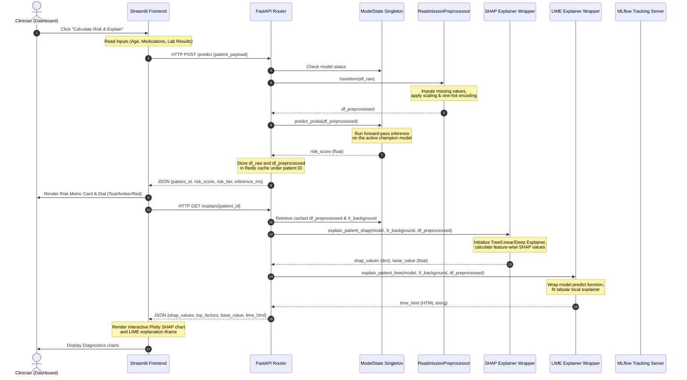

# 🏥 Patient Readmission Risk Predictor (PRRP)

[](https://github.com/Aayankhan07/Patient-Readmission-Risk-Predictor/actions/workflows/ci.yml)
[](https://fastapi.tiangolo.com)
[](https://streamlit.io)
[](https://dvc.org)
[](https://mlflow.org)
[](https://www.python.org)

🏥 **Patient Readmission Risk Predictor (PRRP)** is a production-grade, end-to-end Machine Learning platform designed to predict the likelihood of diabetic patients being readmitted to the hospital within 30 days of discharge. 

The platform implements a comparative model selection process between a classical ML family (Logistic Regression, Random Forest, XGBoost, and the Stacking Classifier ensemble) and a deep learning artificial neural network (ANN). Runs, parameters, artifacts, and metrics are tracked via **MLflow**, data pipelines are orchestrated using **DVC**, explanation payloads (SHAP & LIME) are handled asynchronously via a **FastAPI** backend with a **Redis** cache layer, and audit assessments are logged in a compliance **SQLite** database. These results are served dynamically to a modern Streamlit dashboard.

---

## 1. System Architecture & Information Flow

The platform is fully containerized and orchestrated via Docker Compose:

```
 ┌────────────────────────────────────────────────────────────────────────────────────────┐
 │                              DOCKER COMPOSE NETWORK                                    │
 │                                                                                        │
 │  ┌───────────────────────┐          ┌─────────────────────┐      ┌──────────────────┐  │
 │  │                       │          │                     │      │                  │  │
 │  │  Streamlit Dashboard  │ ───────▶ │  FastAPI Web App    │ ───▶ │  MLflow Server   │  │
 │  │  (Clinician View)     │          │  (Port 8000)        │      │  (Port 5000)     │  │
 │  │  - Score Patient      │          │                     │      │                  │  │
 │  │  - Bulk CSV Upload    │          │  - Background Queue │      └──────────┬───────┘  │
 │  │  - Model Leaderboard  │          │  - SQLite Audit Logs│                 │          │
 │  │  (Port 8501)          │          │                     │                 │          │
 │  │                       │          └──────────┬──────────┘                 │          │
 │  └───────────▲───────────┘                     │                            │          │
 │              │                                 ▼                            ▼          │
 │              │                      ┌─────────────────────┐      ┌──────────────────┐  │
 │              │                      │                     │      │                  │  │
 │              └───────────────────── │    Redis Cache      │      │  Artifact Store  │  │
 │                                     │    (Port 6379)      │      │  /app/mlruns/    │  │
 │                                     │                     │      │                  │  │
 │                                     └─────────────────────┘      └──────────────────┘  │
 └────────────────────────────────────────────────────────────────────────────────────────┘
```

### 🔁 End-to-End System Dataflow


## 🚀 Quick Navigation
* 📈 **[Model Card & Fairness Audits](file:///d:/PROJECT%20REPOS/Patient%20Readmission%20Risk%20Predictor/MODEL_CARD.md)**: Read the clinical intended use, subgroup metrics performance breakdown (with sample count $n$ sizes), and ethical limitations.
* ☁️ **[Cloud Deployment & Infrastructure (IaC)](file:///d:/PROJECT%20REPOS/Patient%20Readmission%20Risk%20Predictor/DEPLOYMENT.md)**: Setup guide and Terraform configurations (`main.tf`) for deploying to Google Cloud Run and AWS ECS Fargate container instances.

### 🛡️ Robust Model Loading & Fallback Strategy
When the FastAPI server starts, its lifecycle manager (`lifespan`) initializes a singleton `ModelState` that handles model resolving automatically, following a strict fallback sequence:
1. **MLflow Production Registry**: Attempts connection to `http://mlflow:5000` to fetch the model version assigned the **`champion`** alias for the registry model `readmission_champion`.
2. **Local Runs Directory Scanning**: If the MLflow server is offline, empty, or lacks a champion alias, it scans the `/app/mlruns` directory (bound to host `./mlruns`), filters for all runs containing `pr_auc`, sorts them in descending order, and loads the best run as a local champion.
3. **Automated Fallback Training**: If no runs are found locally, the server dynamically generates synthetic training data, fits a `ReadmissionPreprocessor`, trains a baseline `LogisticRegression` model, and loads it. **This ensures the API remains fully functional and robust even in a completely fresh sandbox.**

---

## 2. Directory Structure

```
.
├── api/                       # FastAPI serving layer
│   ├── routes/                # Endpoint routers (health, predict, explain)
│   ├── schemas/               # Pydantic request and response schemas
│   ├── utils/                 # Logging and compliance utilities (audit.py)
│   ├── main.py                # FastAPI entrypoint and lifespan management
│   └── model_loader.py        # ModelState singleton, Redis client & MLflow loading fallback logic
├── dashboard/                 # Streamlit clinician frontend
│   ├── components/            # UI components (sidebar, risk card, charts, leaderboard)
│   ├── styles.py              # Clinical visual theme and CSS overrides
│   └── app.py                 # Streamlit main multi-tab dashboard entrypoint
├── data/                      # Dataset repository
│   ├── raw/                   # Raw input clinical CSV
│   └── processed/             # Preprocessed stratified training splits (SMOTE applied)
├── docker/                    # Containerization assets
│   ├── Dockerfile.api         # FastAPI container
│   ├── Dockerfile.dashboard   # Streamlit container
│   └── Dockerfile.mlflow      # MLflow server container
├── models/                    # Serialized local preprocessor models
├── scripts/                   # Model training and orchestration pipelines
│   ├── promote_champion.py    # Script to register and promote the champion in MLflow
│   └── train_all.py           # Master training & evaluation script
├── src/                       # Core ML package modules
│   ├── data/                  # Loader, preprocessor, and splitter modules
│   ├── evaluation/            # Custom metrics and plot generators
│   ├── explainability/        # SHAP and LIME explainer wrappers
│   ├── models/                # Classical estimators, ANN builder, and Optuna tuner
│   └── utils/                 # Parameter configuration loaders
├── tests/                     # Unit test suite
├── docker-compose.yml         # Container orchestrator (spins up Redis, API, MLflow, Dashboard)
├── dvc.yaml                   # Data version control pipeline stages
├── params.yaml                # Global parameters (data splits, model parameters, networks)
└── requirements.txt           # Main python dependency manifest
```

---

## 3. Local Setup & Execution

### 3.1 Setup Virtual Environment
Ensure you have Python 3.10+ installed:
```bash
# Create and activate virtual environment
python -m venv venv
venv\Scripts\activate      # On Windows
source venv/bin/activate   # On Linux/macOS

# Install dependencies
pip install -r requirements.txt
```

### 3.2 Execute DVC Pipeline
Data preprocessing, feature engineering, and model training steps are versioned and structured as reproducible stages in `dvc.yaml`. Run the pipeline using:
```bash
# Execute the entire machine learning pipeline
dvc repro

# Visualize the pipeline stages
dvc dag
```

The pipeline defines three stages:
1. **`prepare`**: Loads `data/raw/diabetic_data.csv`, cleans features, splits data stratifiably (70/15/15), fits the `ReadmissionPreprocessor`, exports `models/preprocessor.pkl`, and saves processed splits under `data/processed/`.
2. **`train_classical`**: Trains Logistic Regression, Random Forest, XGBoost, and the Stacking Classifier ensemble. Logs metrics, plots, and models to MLflow.
3. **`train_ann`**: Compiles and trains the Keras Artificial Neural Network with Early Stopping and logs the training curves to MLflow.

---

## 4. Run the Model Training Pipeline (Custom Flags)

The master training script allows for custom options bypass and hyperparameter search via **Optuna**:
```bash
# Fast training with default parameters in params.yaml
python -m scripts.train_all

# Hyperparameter optimization (Tuning 10 Optuna trials per model family)
python -m scripts.train_all --tune --trials 10
```

### Hyperparameter Configurations (`params.yaml`)
Parameters are controlled globally from [params.yaml](file:///c:/Users/Adeen/OneDrive/Desktop/Patient%20Readmission%20Risk%20Predictor/params.yaml). You can tweak model properties directly:
* **`data`**: Set validation and test split ratios.
* **`models`**: Configure penalty criteria, estimators, and class imbalance handling (`scale_pos_weight` for XGBoost).
* **`ann`**: Adjust network structure (neurons, dropout rates) and training constraints (epochs, batch size, learning rates, patience limits).

---

## 5. Running the Serving Architecture

### 5.1 Run with Docker Compose (Recommended)
Build and spin up Redis, MLflow, FastAPI, and Streamlit dashboard services within a virtual network using:
```bash
docker compose up --build
```
* **FastAPI Docs UI**: `http://localhost:8000/docs`
* **Streamlit Dashboard UI**: `http://localhost:8501`
* **MLflow Tracking UI**: `http://localhost:5000`
* **Redis Caching Container**: `localhost:6379` (Internal service port)

### 5.2 Start Services Standalone
If you prefer running services directly on your host:

1. **Start Redis Server locally** (ensure a Redis server is listening on port 6379).
2. **Start MLflow Tracking Server:**
   ```bash
   mlflow server --host 0.0.0.0 --port 5000 --backend-store-uri sqlite:///mlflow.db --default-artifact-root ./mlruns
   ```
3. **Start FastAPI Service:**
   ```bash
   uvicorn api.main:app --host 0.0.0.0 --port 8000
   ```
4. **Start Streamlit Clinician Dashboard:**
   ```bash
   streamlit run dashboard/app.py --server.port=8501
   ```

---

## 6. API Reference

### `GET /health`
Validates model status, preprocessor status, and system health.
* **Response:**
  ```json
  {
    "status": "ok",
    "model_loaded": true,
    "preprocessor_loaded": true,
    "version": "1.0.0"
  }
  ```

### `GET /models`
Retrieves a list of all logged runs and registered models in MLflow, sorted by `pr_auc` descending.
* **Response:**
  ```json
  {
    "models": [
      {
        "name": "Keras Ann",
        "stage": "Production",
        "pr_auc": 1.0,
        "roc_auc": 1.0,
        "f1": 0.0,
        "accuracy": 0.933,
        "is_champion": true
      }
    ]
  }
  ```

### `POST /predict`
Scores a patient's risk profile, registers background tasks to perform SHAP and LIME computations, and logs the assessment in the HIPAA audit database.
* **Request Body Example:**
  ```json
  {
    "age": "[60-70)",
    "time_in_hospital": 5,
    "num_procedures": 2,
    "num_medications": 14,
    "number_diagnoses": 7,
    "A1Cresult": ">8",
    "insulin": "Steady",
    "diabetesMed": "Yes"
  }
  ```
* **Response Example:**
  ```json
  {
    "patient_id": "8f8303d9-9abf-4be1-987d-419b4ea4e857",
    "risk_score": 0.68,
    "risk_tier": "high",
    "model_version": "keras_ann_run_8f8303d9",
    "inference_ms": 12.45
  }
  ```

### `GET /explain/{patient_id}`
Retrieves background-calculated LIME and SHAP visual explanations from the Redis cache. Returns a `202 Accepted` status if the task is still running, or `200 OK` with the complete payload when done.
* **Response Example (Completed):**
  ```json
  {
    "patient_id": "8f8303d9-9abf-4be1-987d-419b4ea4e857",
    "shap_values": {
      "time_in_hospital": 0.12,
      "num_medications": -0.04
    },
    "top_risk_factors": ["time_in_hospital", "number_diagnoses", "insulin"],
    "base_value": 0.42,
    "lime_html": "<html>...</html>"
  }
  ```

---

## 7. Streamlit Clinician Dashboard Features

The dashboard provides a premium medical decision support workspace:
1. **Score Patient Tab**:
   * Renders real-time demographic and diagnostic inputs via sliders and dropdowns.
   * Renders a clean **Risk Assessment Card** detailing probability, tier bounds, and latency.
   * Includes a **What-If Risk Sandbox** allowing clinicians to interactively alter variables (e.g. adjust medication levels) and see risk score impacts immediately.
   * Displays an interactive **SHAP Feature Contribution Plot** showing individual feature weights driving the current risk score.
   * Embeds an interactive **LIME Explanation HTML frame** indicating local decision boundary approximations.
2. **Bulk CSV Upload Tab**:
   * Accepts multiple patient profiles in a CSV formatted file.
   * Validates dataset formatting and handles missing values.
   * Evaluates records asynchronously and generates a downloadable scored dataset with `Risk Score` and `Risk Tier`.
   * Integrates an interactive Plotly analytics dashboard (pie charts, distributions, high-risk patient lists) for cohort analysis.
3. **Model Comparison Tab**:
   * Fetches the run leaderboard from MLflow and displays a comparative metrics table.
   * Outlines relative metrics (PR-AUC, ROC-AUC, F1, Accuracy) of all trained runs to assist in clinical audits.

---

## 8. Run Unit Tests & CI/CD

Verify the test suite (preprocessor scaling, prediction logic, metrics calculations, and API contracts) directly inside the container by executing:
```bash
docker compose exec api pytest tests/ -v
```

### GitHub Actions CI Workflow
The repository utilizes a CI workflow located at [.github/workflows/ci.yml](file:///d:/PROJECT REPOS/Patient Readmission Risk Predictor/.github/workflows/ci.yml) that automatically runs on every push and pull request to the `main` branch. The job performs the following:
1. Spins up an `ubuntu-latest` runner.
2. Installs Python 3.10.
3. Installs package dependencies via `pip`.
4. Executes the full test suite via `pytest`.
